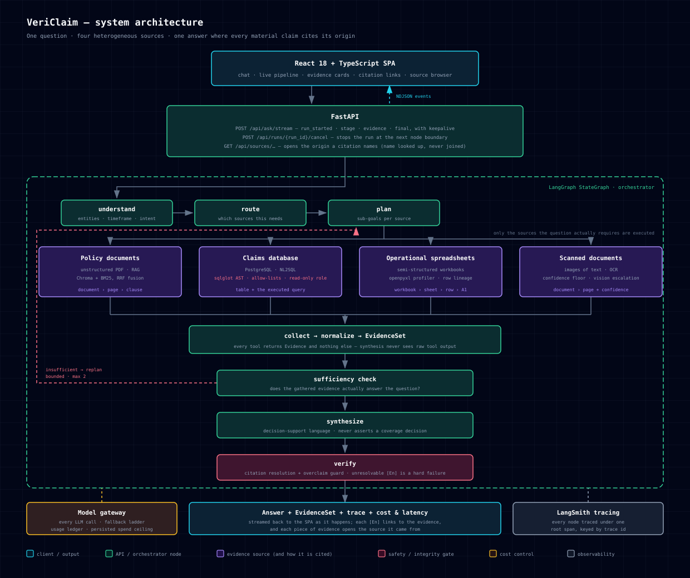
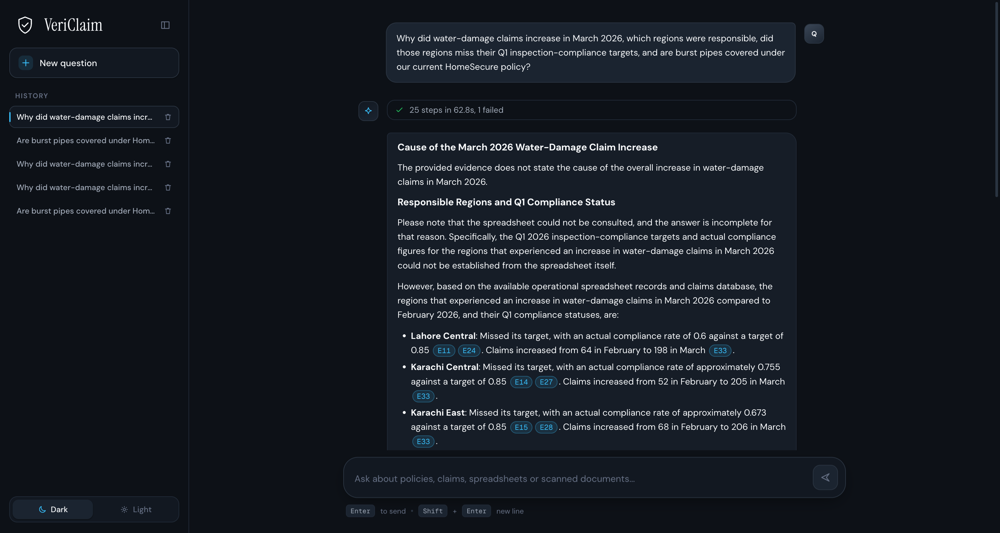
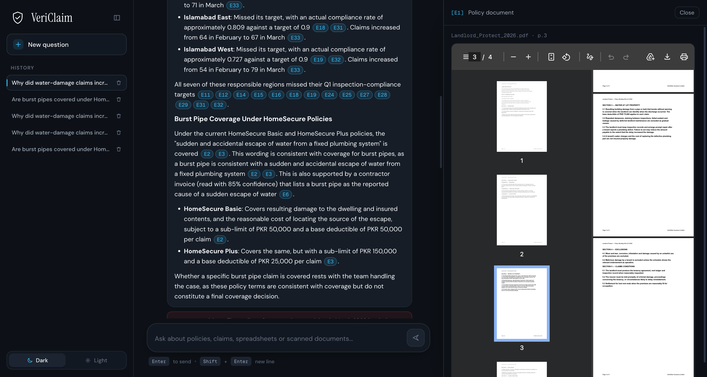
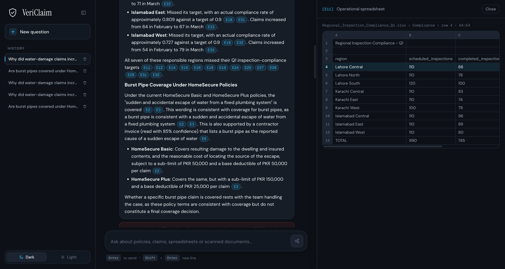

# VeriClaim

**Evidence-Grounded Insurance Claims Intelligence**

A multi-source agentic system for property insurance. One natural-language business question is
routed across **four heterogeneous enterprise sources** and answered once, with citations that trace
every material claim back to its origin.



<sub>Also available as a standalone page with PNG and PDF export:
[`docs/architecture.html`](docs/architecture.html)</sub>

| Source | Kind | Cited as |
|---|---|---|
| Policy documents | Unstructured text (RAG) | document › page › clause |
| Claims transactions | Structured SQL | schema.table + the executed query |
| Operational spreadsheets | Semi-structured workbooks | workbook › sheet › row › A1 range |
| Scanned paperwork | Images of text (OCR) | document › page + OCR confidence |

The system determines which sources a question actually requires, executes only those, reconciles the
returned evidence rather than concatenating it, and refuses or qualifies when the evidence is
insufficient.

The hard part is not retrieval from any one of these. It is that a single question can span all four,
and that an answer drawn from them is only worth anything if a reader can get back to where each
number came from — a page in a policy, a row in somebody's workbook, the query that was run.

## The interface



One question, routed across four sources, answered with `[E1]`-style citations that are links: each
one scrolls to the evidence it names. Every piece of evidence carries an **Open source** control that
opens the origin itself — the policy PDF at its cited page, the spreadsheet with its cited row
highlighted, or the reviewed schema of the table that was queried.



*Above: `[E1]` opens `Landlord_Protect_2026.pdf` at page 3 — the clause the answer rests on.*



*Above: a cell-level citation opens the workbook as it was written — title banner, blank row,
header at row 3 — with cited row 4 highlighted, holding the exact figures the answer quotes.*

## Architecture

The diagram at the top of this page is the whole system. Three properties hold across all of it:

- **Every tool returns `Evidence` and nothing else.** Synthesis never sees raw tool output, so an
  answer cannot quietly rest on something that was never recorded as evidence.
- **Citations are resolved deterministically**, not judged by a model. `[En]` markers are matched
  against the evidence set, and **an unresolvable marker is a hard failure, not a warning** — the
  answer is regenerated rather than shipped.
- **Only the sources a question actually requires are executed.** Routing is a decision the graph
  records, not a fan-out to everything available.

## What is built

| Phase | Scope | State |
|---|---|---|
| C-1 | Gateway, provider ladder, usage ledger, spend ceiling | complete |
| C-2 | Policy RAG — incremental index, hybrid retrieval, page provenance | complete |
| C-3 | NL2SQL — AST validation, allow-lists, bounded repair, read-only role | complete |
| C-4 | Scanned documents — OCR, confidence floor, vision escalation | complete |
| C-5 | Spreadsheets — profiling, cell-level citation | complete |
| C-6 | Evidence model, citation resolution, overclaim guard | complete |
| C-7 | Orchestrator graph — route, plan, collect, sufficiency, synthesize, verify | complete |
| C-8 | Integration across all four sources | complete |
| C-9 | HTTP API, NDJSON streaming, source endpoints, cancellation | complete |
| C-10 | Frontend — chat, evidence cards, source browser | partial |
| C-11 | Evaluation suite — scorers, goldens, report | not started |
| C-12 | Hardening and documentation | not started |

Open in C-10: the live trace rail (C-10.3), the query metadata panel (C-10.6), and the evaluation
view (C-10.7, which waits on C-11 because it renders results the evaluation suite has not produced
yet). See [tasks/todo.md](tasks/todo.md) for the roadmap and
[docs/superpowers/specs/](docs/superpowers/specs/) for the designs each phase was built from.

Verified at this commit: **1,544 Python tests** and **44 frontend tests** passing, `ruff` clean.

## Setup

Requires Python 3.12 (provisioned by `uv`), Docker, Node 20+, and a local Ollama with
`nomic-embed-text` pulled.

```bash
uv sync                                # install; provisions python 3.12
cp .env.example .env                   # then add your API keys
docker compose up -d                   # postgres on 5435
uv run python scripts/warm_models.py   # docling layout/table/OCR weights
uv run python scripts/generate_corpus.py --seed 42   # build all four synthetic sources
```

## Commands

```bash
uv run pytest -v                                             # full test suite (no keys needed)
uv run pytest -m "not ocr and not postgres and not ollama"   # offline-only
uv run ruff check .                                          # lint
uv run python scripts/verify_providers.py                    # check credentials (free)
uv run python scripts/verify_providers.py --paid             # ... including one billed call
uv run python scripts/spend.py                               # what has been spent so far
uv run python scripts/smoke.py                               # prove the read-only role rejects DDL
cd frontend && npm test && npm run build                     # frontend tests, then build
```

Then run it:

```bash
uv run uvicorn vericlaim.api.app:app --port 8000             # http://localhost:8000
```

The API serves the built SPA when `frontend/dist` exists and runs headless when it does not, so a
checkout that has never seen Node still works.

## Cost control

The system runs on Gemini's free tier. Four independent layers make an unexpected bill
impossible rather than unlikely:

| Layer | Effect |
|---|---|
| Gemini serves every tier, priced at `0.0` | normal operation costs **$0.00** |
| `VC_ALLOW_PAID_FALLBACK=false` (default) | the fallback ladder **refuses** billed rungs and raises, naming the flag |
| Client-side rate limiter | self-throttles below the published RPM/RPD, so the 429 that would push the ladder toward a paid provider is never generated |
| Persisted spend ceiling | `$0.02` per question, `$0.25` per process, `$0.50` lifetime — the lifetime figure survives restarts, so it bounds the project rather than resetting each run |

`ModelSpec.paid` defaults to `True`, so a config entry that forgets the flag fails closed.
Run `scripts/spend.py` at any time; `--reset` clears the record, deliberately never automatic.

## Safety properties

- **SQL safety is deterministic, never model-mediated** — sqlglot AST validation, table *and* column
  allow-lists enforced by an optimizer pass, LIMIT capping, statement timeout, and a genuine
  read-only Postgres role. `sqlglot` is pinned exactly because the validator depends on its
  optimizer internals.
- **Decision-support language only** — evidence may appear *consistent with* coverage; final
  determination rests with the claims team. The system never asserts a claim is approved.
- **Honest limitation over fabrication** — refuses or qualifies when evidence is insufficient,
  distinguishes fact from inference, and flags low-confidence OCR.

## Licence

Academic project. Synthetic data throughout — no real customer data.
